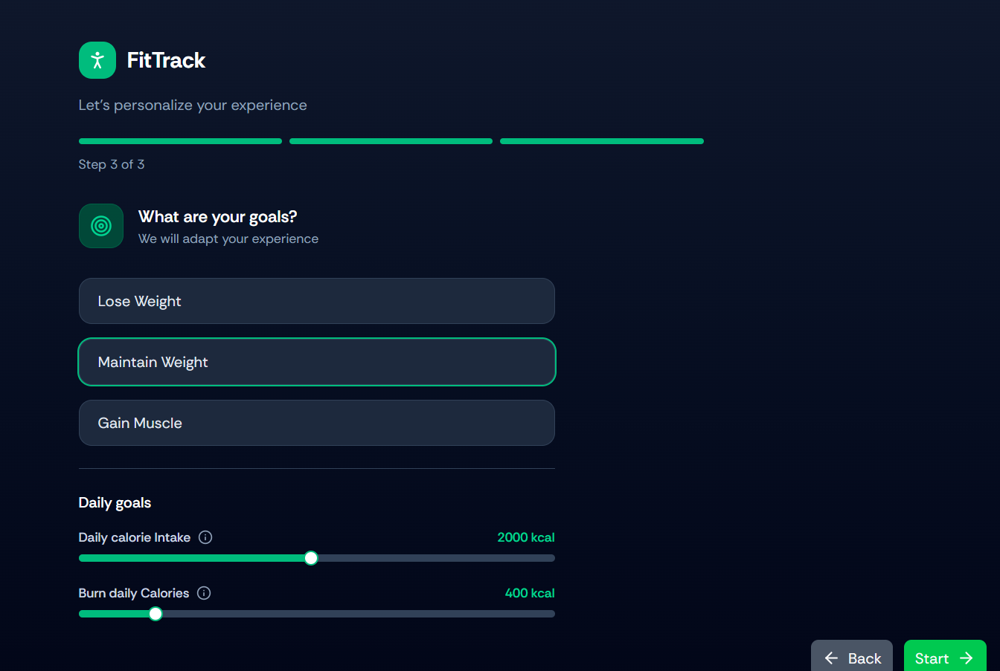
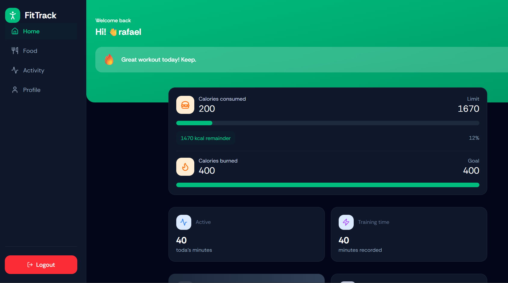

# 🏋️ Fitness Tracker

Aplicação web para acompanhamento de alimentação, atividades físicas e metas de saúde.

O sistema permite registrar refeições, monitorar calorias consumidas e queimadas, acompanhar métricas corporais e definir objetivos personalizados de condicionamento físico.
---
## 📸 Preview


---

## 🚀 Tecnologias Utilizadas

### Front-end

* React 19
* TypeScript
* Vite
* React Router DOM
* Axios
* Tailwind CSS
* Lucide React
* React Hot Toast
* Context API

### Back-end

* Strapi 5
* SQLite
* Users & Permissions Plugin

---

## 📋 Funcionalidades

### 🔐 Autenticação

* Cadastro de usuários
* Login
* Logout
* Persistência de sessão com JWT

### 👤 Onboarding

* Cadastro de idade
* Peso e altura
* Definição de objetivos

  * Perder peso
  * Manter peso
  * Ganhar massa muscular
* Cálculo automático de metas diárias

### 🍽️ Registro Alimentar

* Adicionar refeições
* Categorizar refeições

  * Breakfast
  * Lunch
  * Dinner
  * Snack
* Controle de calorias consumidas
* Exclusão de registros
* Atalhos para registro rápido

### 📊 Dashboard

* Resumo diário
* Calorias consumidas
* Calorias queimadas
* Tempo de atividade
* Progresso das metas
* IMC (Índice de Massa Corporal)
* Métricas corporais
* Mensagens motivacionais

### 🏃 Atividades Físicas

* Registro de atividades
* Controle de duração
* Controle de calorias queimadas

---

## 📂 Estrutura do Projeto

```bash
fitness-tracker/
│
├── client/
│   ├── src/
│   │   ├── components/
│   │   ├── pages/
│   │   ├── context/
│   │   ├── configs/
│   │   ├── assets/
│   │   └── types/
│   │
│   └── package.json
│
├── server/
│   ├── src/
│   ├── config/
│   └── package.json
│
└── README.md
```

## ⚙️ Instalação

### Clonar o projeto

```bash
git clone https://github.com/seu-usuario/fitness-tracker.git
```

### Front-end

```bash
cd client

npm install

npm run dev
```

### Back-end

```bash
cd server

npm install

npm run develop
```

---

## 🔑 Variáveis de Ambiente

### Front-end (.env)

```env
VITE_STRAPI_API_URL=http://localhost:1337
```

### Back-end

Configure as variáveis de ambiente do Strapi conforme a documentação oficial.

---

## 📸 Principais Recursos

* Dashboard com estatísticas diárias
* Controle de alimentação
* Controle de atividades físicas
* Definição de metas personalizadas
* Cálculo de IMC
* Autenticação JWT
* API Headless com Strapi

---

## 🎯 Objetivo do Projeto

Projeto desenvolvido para praticar conceitos de desenvolvimento Full Stack utilizando:

* React
* TypeScript
* Context API
* Consumo de APIs REST
* Autenticação JWT
* Strapi CMS
* Tailwind CSS

---

## 👨‍💻 Autor

Desenvolvido por Fabiana Silva.

LinkedIn: adicione seu perfil aqui

GitHub: adicione seu GitHub aqui
